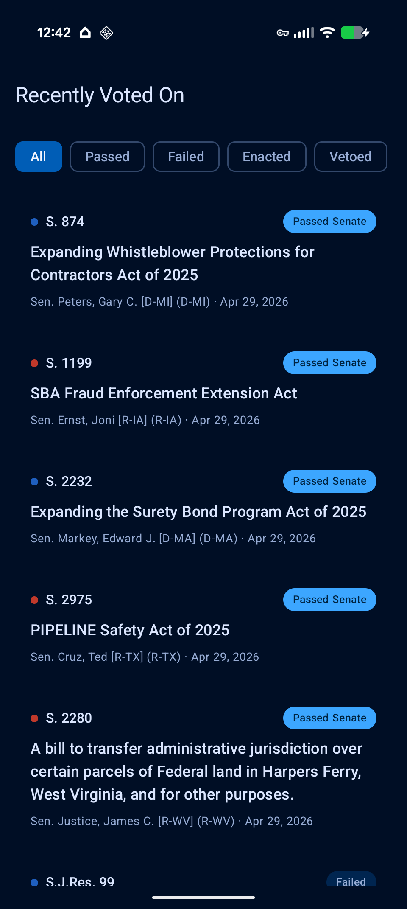

# Informed Citizen

A Kotlin / Jetpack Compose Android app that lists recently voted-on U.S.
Congressional bills and lets the user hand any bill off to **ChatGPT,
Claude, or Gemini** for a plain-English summary. The app brings no LLM
of its own — it builds a structured prompt and shares it via Android's
`ACTION_SEND` system to whichever AI app the user prefers.

<p align="center"></p>

## Tech stack

| Layer | Choice |
|---|---|
| Language | Kotlin 2.3.21 |
| UI | Jetpack Compose + Material 3 |
| Architecture | MVVM (single repository) |
| DI | Hilt (KSP, no kapt) |
| Networking | Retrofit 3 + OkHttp 5 + kotlinx-serialization-json |
| Async | Coroutines + Flow |
| Persistence | DataStore (Preferences) |
| Build | Gradle Kotlin DSL with `libs.versions.toml`, AGP 9.2 |
| Min SDK | 26 (Android 8) |
| Target SDK | 36 |
| Strictness | `-Werror` on Kotlin + Java, `lint.warningsAsErrors = true` |

## Project layout

```
android/app/src/main/java/com/informedcitizen/
├── data/
│   ├── api/               # Retrofit + bill-text fetcher
│   ├── model/             # Bill, Sponsor, Action, Outcome…
│   └── repository/        # BillRepository (cache + DataStore)
├── ui/
│   ├── billslist/         # BillsListScreen + ViewModel
│   ├── billdetail/        # BillDetailScreen + ViewModel + summarize sheet
│   ├── components/        # BillCard, OutcomeChip
│   ├── theme/             # Material 3 + party colors
│   └── util/              # Format helpers, Custom Tabs
├── share/                 # LlmTarget + LlmShareHelper
├── di/                    # Hilt modules
└── MainActivity.kt
```

## Building

Open `android/` in Android Studio Hedgehog or newer, or from the command
line:

```bash
cd android
./gradlew :app:assembleDebug
./gradlew :app:installDebug    # with a device or emulator attached
```

The first build downloads Gradle 9.4.1 and the AGP 9.2.0 toolchain. The
build is strict — Kotlin warnings, Java warnings, and lint warnings are
all errors. New dependencies that surface deprecation warnings will fail
the build until you upgrade or `@Suppress` deliberately.

## License

Licensed under the Apache License, Version 2.0. See [LICENSE](LICENSE) for
the full text.
