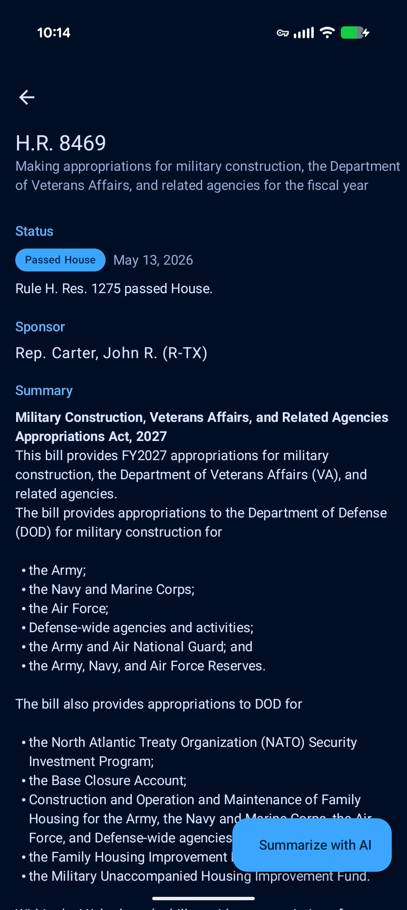

# Maintaining the landing page

Notes for whoever (often: a future Claude session) needs to touch the
two pages this guide covers — `docs/index.html` (the landing page) and
`docs/run-your-own.html` (the pipeline walkthrough) — or the assets
under `docs/images/`.

**Out of scope on purpose.** The pipeline-status dashboard
(`docs/pipeline.html`) and the privacy policy (`docs/privacy.html`)
predate the 2026-05-13 redesign and use their own minimal CSS. Don't
apply conventions from this file to them; they have their own. This
guide is also not a substitute for repo-wide rules in the root
`CLAUDE.md` or the global `~/.claude/CLAUDE.md` — those still apply on
top of everything here.

## What lives where

```
docs/
├── index.html              # Landing page (redesigned 2026-05-13)
├── run-your-own.html       # Mid-depth pipeline walkthrough
├── pipeline.html           # Freshness dashboard (untouched by the redesign)
├── privacy.html            # Privacy policy (untouched by the redesign)
├── images/
│   ├── icon.svg            # Site logo — hand-translated from the Android drawables
│   ├── billslist.png       # "Browse" feature row
│   ├── billdetail.png      # "Read a bill" feature row
│   ├── calendar.png        # "Is Congress in session?" feature row
│   ├── reps.png            # "Who represents you?" feature row
│   └── settings.png        # "Yours to tune" feature row
├── data/                   # JSON feed — written by GitHub Actions, do not edit by hand
└── MAINTAINING-LANDING-PAGE.md  # This file
```

The original spec and plan are gitignored under
`docs/superpowers/specs/2026-05-13-index-html-redesign-design.md` and
`docs/superpowers/plans/2026-05-13-index-html-redesign.md` (per the
project rule that specs and plans don't get committed). They're useful
historical context but they describe the redesign as it was *built*,
not as it is *now* — trust the live HTML over the spec.

## Conventions

These hold across `index.html` and `run-your-own.html`. If a future
change breaks one of them, decide deliberately rather than drifting.

### No build step, no JavaScript, no remote dependencies

Both pages are single self-contained HTML files with inline `<style>`
blocks. There is no Webpack, no Jekyll, no Tailwind, no Google Fonts
fetch, no analytics snippet. Adding any of those is a deliberate
architectural change, not a maintenance task.

### Visual system is duplicated, not shared

The CSS token set (`--fg`, `--accent`, `--gold-bg`, etc.), base
typography, header styles, and footer styles are duplicated in both
HTML files. When the page count grows past two, that becomes
DRY-painful and worth extracting to a shared stylesheet. At two pages,
the duplication is cheaper than the abstraction.

### Palette

| Token         | Light          | Dark           | Source                                            |
|---------------|----------------|----------------|---------------------------------------------------|
| `--fg`        | `#1a1a1a`      | `#ececec`      |                                                   |
| `--fg-muted`  | `#5a5a5a`      | `#9a9a9a`      |                                                   |
| `--bg`        | `#f8f8f8`      | `#0d1525`      |                                                   |
| `--bg-card`   | `#ffffff`      | `#1a2438`      |                                                   |
| `--border`    | `#e3e3e3`      | `#2a3550`      |                                                   |
| `--accent`    | `#1B2A4A`      | `#6ea8ff`      | navy from `ic_launcher_background.xml`            |
| `--accent-on` | `#ffffff`      | `#0d1525`      | foreground on the accent button                   |
| `--gold`      | `#D9A43B`      | `#D9A43B`      | muted gold (icon's `#C9A84C` is harder to read)   |
| `--gold-bg`   | `#fef5dc`      | `#332a14`      | Commitments-section background                    |
| `--gold-border` | `#1B2A4A`    | `#6ea8ff`      | Left accent bar on Commitments — same as accent   |

Dark-mode `--accent` deliberately shifts to light-blue `#6ea8ff`
because navy on near-black would fail contrast. Don't try to make it
navy.

### Typography

- Headings (`h1`, `h3`): `Georgia, "Source Serif Pro", serif`. System
  serif, no web-font fetch.
- Body + `h2`: system sans (`-apple-system, BlinkMacSystemFont, "Segoe
  UI", Roboto, sans-serif`).
- `h2`s are styled as small uppercase muted labels (~0.78rem, 0.06em
  letter-spacing) — not large titles. This is intentional; the page's
  visual hierarchy treats `<h2>` as section markers, not headers in the
  traditional sense.

### Entities, not literal Unicode

Use `&rarr;` (→), `&larr;` (←), `&mdash;` (—), `&middot;` (·) in HTML
source. The reason: a literal `→` in source got flagged in code review
as inconsistent with the surrounding entity-based markup. Pick one
encoding and use it everywhere. Today that's entities.

Inside `<pre><code>` blocks, escape `<` and `>` as `&lt;` and `&gt;`
even when they're inside placeholder text like `&lt;your-user&gt;`.

### External links don't open in new tabs

No `target="_blank"`, no `rel="noopener"`. Consistent with the rest
of the page; consistent with how Pages-style docs sites typically
behave. If you change this, change it everywhere at once.

### Anchors

The hero "Install" CTA targets `#install`. The install `<section>`
has `id="install"`. Keep them paired. If you rename the section
identifier, grep for `#install` and update both sites.

### Commitments grid is sensitive to text length

The 2-column commitments grid uses CSS Grid where each row's height
follows the tallest cell. Adding a 5-line commitment next to a 2-line
one creates visible empty space below the short one. Before changing
the copy:

- Roughly count rendered line count per cell.
- Pair similar-length cells in the same row by re-ordering the
  `<div class="commitment">` blocks.
- Three rows of two cells each, balanced within ±1 line, is the
  current state and the target.

If you genuinely can't balance, consider switching to a 3-column grid
on desktop or letting one row sit asymmetric for a clear reason.
Don't add masonry — browser support is still spotty.

### Hero is text-only on purpose

The hero is title + tagline + dual CTAs, with no screenshot. The
visual proof lives in the Features section below, where every feature
gets its own thumbnail. Putting a phone shot in the hero AS WELL would
duplicate the visual argument, so the hero stays a pitch and the
features carry the proof. Don't add a hero screenshot without
re-thinking the features section.

### Features section: every feature has a screenshot

The features grid is conceptually a 2-column desktop layout, but every
current feature is a `.feature.feature-with-shot` that spans both
columns via `grid-column: 1 / -1`. Inside each row, the layout is
text-left | image-right on desktop (`1fr auto`) and stacks on mobile.

Today the section has five rows: **Browse**, **Read a bill** (which
also folds in the AI handoff — there's no separate "Hand it to an AI"
row because the AI action is invisible to a screenshot and the
tagline already mentions it), **Is Congress in session?**, **Who
represents you?**, and **Yours to tune**.

If you add a feature, follow the same pattern: a `<div class="feature
feature-with-shot">` containing a text `<div>` and an ``. The image is
capped at 360×360 by `.feature-with-shot > img { max-height: 360px;
max-width: 360px; }`; tune `--crop-y` per the *Screenshot crop
modifier* section below.

The plain `.feature` class still exists for text-only cells (it'd
live in the 2-column row) but nothing uses it today. If you ever need
to add a text-only feature, pair it with another text-only one in the
same row so neither cell sits next to dead space.

### Screenshot crop modifier

All four feature-row screenshots crop to a feature-focused slice
rather than rendering as full phone shots. The cropping is driven by
two CSS custom properties set inline per ``:

```html

```

The `.screenshot-crop` class itself does the mechanical work:

```css
.screenshot.screenshot-crop {
  aspect-ratio: var(--crop-aspect, 9 / 10);
  object-fit: cover;
  object-position: center var(--crop-y, 0%);
}
```

`--crop-y` shifts which vertical slice of the source image survives
the crop (0% = top, 100% = bottom). `--crop-aspect` defaults to `9/10`
and rarely needs overriding — that aspect shows ~50% of a 9:20 phone
screenshot per crop, which is the right amount of content for an
inline thumbnail.

**Current per-image `--crop-y` values** (tuned 2026-05-14):

| Image            | `--crop-y` | Visible slice | What lands in view                                |
|------------------|------------|---------------|---------------------------------------------------|
| `billslist.png`  | `12%`      | 6%–56%        | In-session status line → filter chips → first few bill cards |
| `billdetail.png` | `14%`      | 7%–57%        | Headline → status → sponsor → bill title → summary start     |
| `calendar.png`   | `24%`      | 12%–62%       | Today-card → legend → May header → first 4 grid rows         |
| `reps.png`       | `30%`      | 15%–65%       | Both senators + the House Reps label + the House rep card    |
| `settings.png`   | `28%`      | 14%–64%       | Theme picker + Crash-reporting toggle                        |

The rough math: at `aspect-ratio: 9/10`, the visible window covers
50% of the source image's height. `visible-start = --crop-y / 2`,
`visible-end = visible-start + 50%`. Tune by raising or lowering
`--crop-y` until the right band of content is centered.

Combined with `max-height: 360px` and `max-width: 360px` on
`.feature-with-shot > img`, the rendered thumbnail is about
324×360px — readable but compact, sized to a screenshot caption
rather than a full phone shot.

## Routine maintenance tasks

### Refreshing screenshots

The user keeps fresh Play-Store-quality captures in
`play-listing/screenshots/`. When the app UI changes, copy the
relevant captures into `docs/images/` under the stable names the HTML
expects:

```bash
cp play-listing/screenshots/<latest-bills-list>.png   docs/images/billslist.png
cp play-listing/screenshots/<latest-bill-detail>.png  docs/images/billdetail.png
cp play-listing/screenshots/<latest-calendar>.png     docs/images/calendar.png
cp play-listing/screenshots/<latest-reps-list>.png    docs/images/reps.png
cp play-listing/screenshots/<latest-settings>.png     docs/images/settings.png
```

After replacing `settings.png`, re-check the `.screenshot-crop`
parameters (see "Screenshot crop modifier" above) — the crop is
calibrated to the current Settings layout (Theme + Crash reporting)
and may need re-tuning if the screen reorganizes.

For the other screenshots, no cropping is applied and re-checking
isn't required unless the new capture has substantially different
chrome (e.g., a redesigned top app bar).

### Refreshing the icon

`docs/images/icon.svg` is hand-translated from
`android/app/src/main/res/drawable/ic_launcher_foreground.xml` and
`ic_launcher_background.xml`. If the launcher icon changes, the SVG
needs to be re-translated; the dpi-constrained webp mipmaps under
`mipmap-*hdpi/` are *not* a reliable source — they tend to lag the
vector drawables.

The translation is mechanical: each `<path>` / `<line>` element in the
drawable maps to an SVG element with the same coordinates and colors.
The background drawable's `fillColor` becomes a `<rect>` covering the
whole viewBox.

### Bumping the footer date

`docs/index.html` ends with `Last updated YYYY-MM-DD.` Bump it when
content changes. The other pages don't carry a last-updated date and
don't need one.

### Adding a new section to `index.html`

Pattern (used during the original redesign across Tasks 3–7):

1. Add the section's CSS rules immediately before the closing `</style>`.
2. Add the section's `<section>` block inside `<main>`, in the order
   that fits the page narrative (hero → marketing → operations →
   footer).
3. Keep the section's class names scoped (`.commitments-grid`, not
   `.grid`).
4. Verify the page still parses:
   ```bash
   python -c "from html.parser import HTMLParser; p = HTMLParser(); p.feed(open('docs/index.html', encoding='utf-8').read()); print('ok')"
   ```
5. Bump the footer date.

### Local preview

```bash
python -m http.server --directory docs 8765
```

Open `http://localhost:8765/`. Resize the browser narrow (~390px) to
confirm mobile layout. DevTools → Rendering → Emulate CSS
`prefers-color-scheme: dark` to check dark mode.

There's no automated visual test — visual regression is human-eyeball.

## Gotchas

### Bot commits rebase under you

The data-pipeline workflows commit to `main` automatically:
`update-bills.yml` (daily), `backfill-bills.yml` (daily),
`update-session-calendar.yml` (daily), `update-members.yml`
(weekly), `update-zip-crosswalk.yml` (quarterly). Between any two
human commits, expect 1–N bot commits to have landed on `origin/main`.

Always `git pull --rebase origin main` before pushing. The bots only
touch `data-pipeline/state/` and `docs/data/*.json` (and occasionally
regenerate `docs/pipeline.html`) so conflicts with website edits are
essentially impossible — the rebase will be clean.

If `git pull --rebase` complains about unstaged changes (typically
the always-modified `.gitignore`), stash those temporarily:

```bash
git stash push -m "wip" -- .gitignore
git pull --rebase origin main
git stash pop
```

### Pre-existing untracked files

The working tree always shows untracked items: `.idea/`, `.smoke/`,
modified `.gitignore`, sometimes `android/gradle/gradle-daemon-jvm.properties`.
These predate any redesign work. Don't accidentally stage them — use
explicit paths in `git add`, not `git add -A` or `git add .`.

### `docs/superpowers/` is gitignored

Specs, plans, brainstorming session mockups all live there. Don't try
to commit them; if you want them shared, write them to a different
path. The intent is that this stays Claude-Code-internal.

### Privacy claims must stay honest

The Commitments section makes definite claims about what the app does
and doesn't collect. Don't add a commitment the app doesn't actually
honor. When the app changes (e.g., adds a permission, enables a new
SDK, opt-in or otherwise), audit the commitments before pushing.

The current commitment 4 deliberately doesn't enumerate the specific
permission set ("`INTERNET` only") because that list could go stale.
It claims the load-bearing fact — *crash data is opt-in* — and points
readers at the privacy policy for the exhaustive list. Keep that
shape.

## Style of changes

- **Frequent, small commits.** The redesign landed as 12 commits, one
  per logical section. Future edits should follow the same shape — a
  one-section change is one commit.
- **Imperative present-tense subject lines**, scoped to `docs:`:
  `docs: refresh bills-list screenshot for 119th Congress`.
- **Body of the commit message explains *why*** if it's not obvious
  from the diff. The diff says what; the message says why.
- **Confirm before pushing.** Direct-to-main is the project's pattern,
  but pushing affects what visitors see, so confirm with the user
  rather than auto-pushing — especially since the data pipeline may
  have landed commits since the last fetch.
